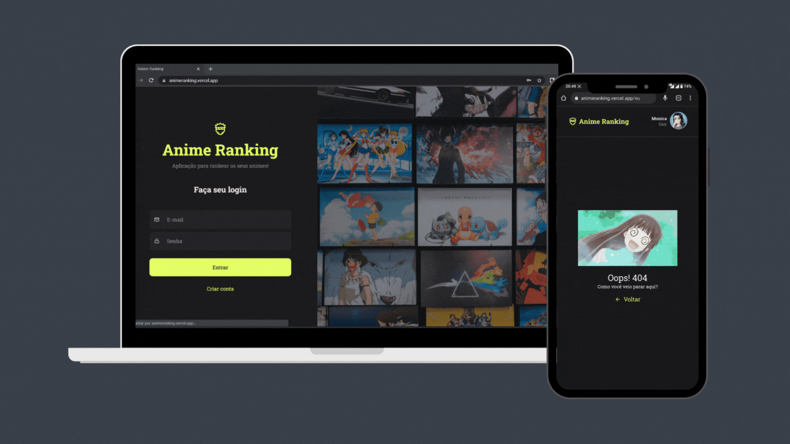

<h1>Anime Ranking</h1>
Uma aplicação para rankear os animes que você assistiu!
   

Você tem a opção de adicionar os animes manualmente ou selecioná-los num guia!

Clique <a href="https://animeranking.vercel.app/" target="_blank">aqui</a> para acessar!

### Preview

### Tech Stack

O projeto foi feito com [React](https://reactjs.org/) e [Styled-Components](https://styled-components.com/) no **client-side**, [Node](https://nodejs.org/en/), [Knex](http://knexjs.org/) e [SQLite](https://www.sqlite.org/index.html) no **server-side**. Também consumimos a [Jinkan API](https://docs.api.jikan.moe/).

Clique <a href="https://github.com/M0nicaVaz/animeranking-api" target="_blank">aqui</a> para acessar o repositório do nosso servidor!

Com 💜 por <a href="https://www.linkedin.com/in/monica-vaz/" target="_blank"> Monica Vaz </a>

